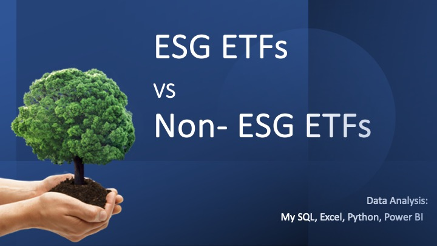

# ESG_ETF_analysis 

## Overview
This project conducts a comprehensive data analysis on ESG (Environmental, Social, and Governance) ETFs, comparing their returns to traditional ETFs across various markets.

  
   

## Key Features
- **Data Sources**: Main datasets were procured from Yahoo Finance and etf.com.
- **Data Management**: Initial data aggregation and organization were done using MS Excel.
- **Analysis Tools**: Comprehensive data analysis was performed using **Python** (with libraries such as pandas, matplotlib, and seaborn), **SQL**, and **Power BI**.
- **Metrics Analyzed**: Our project delves deep into various performance metrics such as:
  - Cumulative return
  - Excess return
  - Standard deviation (representing risk)
  - Sharpe Ratio
  - Information Ratio (both representing risk-adjusted returns)
  

    
     
  

## Key Findings
- Broadly, ESG ETFs and Non-ESG ETFs showcase similar performance in terms of long term returns.
- However, there are more difference when looking at specific markets and during different economic cycles.

## Usage
For those looking to navigate through our analysis:
1. Begin by examining the raw datasets provided.
2. Dive into the Python scripts for a detailed walkthrough of our data cleaning, processing, and analysis.
3. Visual representations are best viewed in our Python scrpits and Power BI dashboards, providing a graphical comparison between ESG and traditional ETFs.
4. For in-depth individual ETF analysis, our SQL queries and Excel worksheets are also available.
5. All-in-one go analysis can be viewed via **Powerpoint** provided.

